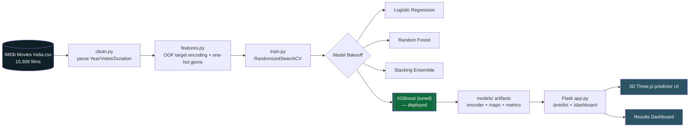

<div align="center">


[](https://www.python.org/)
[](https://flask.palletsprojects.com/)
[](https://threejs.org/)
[](#-results)

[](https://git.io/typing-svg)

</div>

---

## 📖 Overview

Predicts whether a movie will be **High-Rated** (IMDb rating ≥ 6.5) using only five inputs available *before* release: primary **Genre**, **Director**, **Lead Actor**, **Release Year**, and **expected Vote count**. Trained on the **IMDb Movies India** dataset (15,509 films) and deployed behind a Flask app with a full **3D Three.js** predictor UI.

---

## 🏗️ Architecture

<div align="center">

</div>

<details>
<summary>Mermaid source (fallback / editable)</summary>



</details>

---

## 📁 Project Structure

```text
├── src/
│   ├── clean.py       # parse + clean raw CSV, build High_Rated target
│   ├── features.py    # OOF smoothed target encoder, one-hot genre, matrix builder
│   └── train.py       # tune + train/compare models, save artifacts + dashboard plots
├── app/
│   ├── app.py         # Flask app: /predict and /dashboard
│   ├── templates/     # index.html (3D form), dashboard.html (results)
│   └── static/        # style.css, generated charts, Three.js scene
├── models/            # trained model, encoder, maps, metrics (generated)
├── run_app.py         # launch the web app
└── requirements.txt
```

---

## 🔬 Methodology

1. **Cleaning** — parse `Year` from `(2019)`, `Votes` from `"1,086"`, `Duration` from `"142 min"`; coerce `Rating` to numeric; drop unrated rows; build `High_Rated = Rating >= 6.5`.
2. **Feature engineering** — out-of-fold, smoothed target encoding for `Director`, `Lead Actor`, `Actor 2`, `Actor 3` (leakage-free); one-hot encode primary `Genre`; log-scale `Votes`; retain `Year`, `Duration`, genre count.
3. **Modeling** — stratified 80/20 split; `RandomizedSearchCV` (5-fold) tuning for XGBoost and Random Forest; a stacking ensemble compared against the tuned single model. Model selection happens on **out-of-fold predictions only** — the test split is touched exactly once.
4. **Deployment** — Flask app with an interactive 3D scene and a results dashboard.

---

## 📊 Results

| Model | Accuracy | Precision | Recall | F1 | ROC-AUC |
|---|:---:|:---:|:---:|:---:|:---:|
| Logistic Regression | 0.754 | 0.721 | 0.536 | 0.615 | 0.796 |
| Random Forest (tuned) | 0.759 | 0.724 | 0.552 | 0.627 | 0.827 |
| Stacking Ensemble | 0.782 | 0.745 | 0.614 | 0.673 | 0.847 |
| **XGBoost (tuned) — deployed** | **0.783** | **0.751** | **0.609** | **0.673** | **0.847** |
| Baseline (majority class) | 0.634 | — | — | — | 0.500 |

The deployed XGBoost reaches **78.3% accuracy** — a **+14.9 point lift** over the 63.4% majority-class baseline — using only a handful of pre-release inputs. The stacking ensemble matched it on F1/ROC-AUC, but out-of-fold selection kept the simpler tuned XGBoost as the production model.

---

## ⚡ Quick Start

### Setup
```bash
pip install -r requirements.txt
```

### Train
Point at the IMDb Movies India CSV ([Kaggle](https://www.kaggle.com/datasets/harshitshankhdhar/imdb-dataset-of-top-1000-movies-and-tv-shows)):
```bash
python -m src.train "path\to\IMDb Movies India.csv"
```
Writes the best model, fitted target encoder, genre/feature column maps, `metrics.json`, and dashboard charts into `models/`.

### Run the web app
```bash
python run_app.py
```
Open **http://127.0.0.1:5000**

---

## 🖥️ Using the App

- **Predictor (3D)** — a full Three.js scene with a starfield and a glowing probability meter that fills and changes color with every prediction; the form card tilts in 3D as you move the mouse. Enter genre, director, lead actor, year, and expected votes (plus optional duration/extra actors) for a `High-Rated` / `Not High-Rated` verdict with confidence. Unknown directors/actors fall back to the dataset prior.
- **Results Dashboard** — model comparison table, confusion matrix, ROC curves, feature importance, metric bars, and 50 sample test predictions.

> Three.js is bundled locally in `app/static/js/three.min.js`, so the 3D UI works fully offline.

---

## 🛠️ Tech Stack


<div align="center">

</div>
